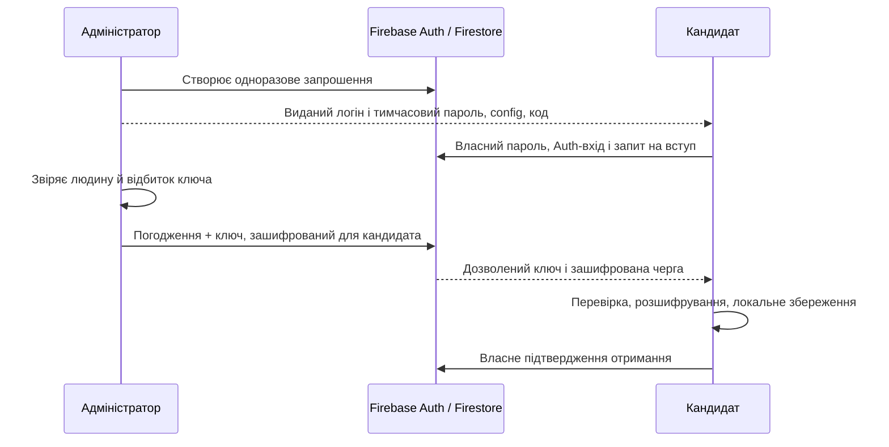

# БЕТА 1 · архітектура команд та обмеження

Стан документа: **20 вересня 2026 року**. Поточний напрям — власний Firebase Spark-проєкт адміністратора, статичний сайт на GitHub Pages, зашифрований локальний простір на кожному пристрої. [Налаштування бази](FIREBASE-SETUP.md) описує конкретні дії в Console та застосунку. Реального хмарного проєкту в межах розробки не створено; тестування Rules в емуляторі не підтверджує придатність для військових даних.

## Особистий простір і мережевий акаунт

| Рівень | Що робить |
| --- | --- |
| Локальний простір | Зберігає особисті задачі, ключі, командну історію та черги в зашифрованому IndexedDB. |
| PIN | Розблоковує локальні дані; новий код — 4 цифри, старі 6–12 підтримуються. |
| Firebase Auth | Окремий мережевий вхід за виданим логіном і паролем; технічна адреса `логін@projectId.invalid`, без особистої пошти. |
| `USERS/{логін}` | Адміністративний дозвіл із точним UID, `enabled`, `mustChangePassword`, `resetAfter`; паролів і хешів тут немає. |
| Ключі простору | Програмні ECDSA/ECDH-ключі підпису та передавання ключа команди. |
| Ключ команди | Шифрує спільний вміст; його отримують погоджені учасники. |
| Firestore Rules | Перевіряють дозвіл `USERS`, UID і час входу, членство, ролі, призначення, версії та дозволені зміни доставки. |

Публічний config визначає проєкт, а не надає права до його даних. Пароль Firebase не зберігається у локальній конфігурації; мережевий сеанс і Firestore cache тримаються в пам’яті. Розшифровані задачі не зберігаються у стандартному постійному кеші SDK. Приватні ключі й локальна черга лишаються всередині зашифрованого простору.

**Чотири цифри мають лише 10 000 комбінацій.** KDF уповільнює перебір викраденої копії, але не додає PIN ентропії; обмеження спроб у UI не зупиняє офлайн-перебір. Цього недостатньо для самостійного захисту військових даних. Назва простору та логін із паролем також не підтверджують особу людини.

Один Firebase UID закріплюється за криптографічною ідентичністю простору. JSON-імпорт клонує цю ідентичність і ключі; це перенесення копії, а не безпечне додавання незалежного пристрою. Одночасна робота двох клонів може порушити доставку. Втрата локальних ключів не усувається скиданням Firebase-пароля.

## Адміністративна видача та відновлення доступу

Самостійної реєстрації в інтерфейсі немає. Адміністратор створює Auth-користувача й `USERS/{логін}` через Console або довірений `scripts/manage-accounts.mjs`, видає тимчасовий пароль, а людина встановлює власний. Логін — 3–32 ASCII-символи; пароль користувача — 12–128 символів. Auth сам обробляє пароль; Firestore не зберігає його або окремий хеш. Вебклієнт не може створити дозвіл `USERS`, змінити UID чи сам увімкнути доступ. Створений стороннім клієнтом Auth-акаунт сам по собі не дає доступу до команд.

Скидання спершу атомарно вимикає `enabled`, потім змінює пароль Auth і відкликає refresh tokens. Після успіху дозвіл повертається з `mustChangePassword: true` та `resetAfter` у секундах. Rules вимагають відповідність UID і `auth_time > resetAfter`, тому старий сеанс не повертає доступ після ввімкнення. UID зберігається, як і його прив’язка до ключів. Це не відкликання групового ключа й не видалення вже отриманих локальних даних.

Auth і Firestore не є спільною транзакцією. За часткової помилки дозвіл залишається вимкненим, а невідомий результат фінального мережевого запису потребує перевірки. Звичайний reset не підхоплює вимкнений запис; явний `--resume` призначений для перевіреного відновлення одним адміністратором. Precondition за часом версії документа захищає початок і завершення від перезаписування іншого адміністратора. Створені Auth-акаунти ніколи автоматично не видаляються при помилці. ADC і Admin SDK використовуються лише в довіреному середовищі; їх немає в статичному пакеті Pages.

`mustChangePassword` блокує звичайний інтерфейс до зміни пароля. Rules дозволяють власнику UID скинути цю позначку, але не можуть перевірити зміну пароля в Auth: змінений клієнт може обійти цей крок. Це відоме обмеження без окремої довіреної перевірки. Облікові дані, створені ще зі звичайною email-адресою, потребують адміністративного перенесення зі збереженням UID; `create` і `reset` такого перенесення не виконують.

## Початковий власник, вступ і ролі

Адміністратор сам створює Firebase-проєкт, свій Auth-акаунт і запис `USERS`. Через Console він створює `/system/bootstrap` з полем `ownerUid`; UID також показаний після входу в застосунку. Rules не дозволяють клієнтам змінювати цей документ; створювати команди може тільки цей UID. Наявність Auth-акаунта або дозволу `USERS` не дає прав власника автоматично.

Запрошення містить 32 випадкові байти, одноразове й діє менше 15 хвилин. Сам код дає можливість подати заявку. Адміністратор окремо погоджує людину й передачу ключа. Новому учаснику надсилається зашифрований знімок локальної історії адміністратора.

Власник може надавати роль адміністратора. Адміністратор погоджує учасників і може виконувати командні задачі та етапи; звичайний учасник змінює свої призначення. Завершення батьківської задачі за наявності незавершених етапів заборонене. Серверні перевірки не замінюються прихованими кнопками.

**У прототипі немає видалення учасника або пониження ролі.** Для цього потрібні історія повноважень, відкликання пристроїв і ротація ключів. Поки всі погоджені учасники читають вміст усієї команди; «Мені» / «Від мене» — фільтри. Призначення етапу не створює окремої криптографічної області доступу.

## Вміст і метадані

Текст задач, етапів, назва команди, час дій та історія передаються як зашифрований AES-GCM-вміст. Ключ передається погодженому учаснику через ECDH/HKDF; клієнти перевіряють цифрові підписи подій. Зв’язок із Firestore проходить через HTTPS.

Firestore бачить логін і його дозвіл, UID і відкриті ключі, членство, ролі, адресатів, ID задач і етапів, призначення, версії, поточні статуси виконання та доставки. Firebase Authentication окремо обробляє технічні email-акаунти та паролі. Провайдер може бачити мережеві адреси й часовий рисунок обміну. Шифрування тексту не приховує всі ці зв’язки.

Rules перевіряють структуру та авторизацію, але не виконують ECDSA/Web Crypto. Підписи перевіряє клієнт-одержувач. Адміністратор Firebase-проєкту має привілейовані можливості змінити Rules і документи; цей рівень доступу не можна ігнорувати. Статичний сайт теж є довіреною частиною: шкідливе оновлення JavaScript може прочитати дані розблокованого простору. [Firebase Rules](https://firebase.google.com/docs/firestore/security/get-started), [Web Crypto: security considerations](https://www.w3.org/TR/webcrypto/#security-considerations)

Погоджений зловмисний учасник може надіслати формально допустимий конверт із некоректним підписом або вмістом. Клієнт ізолює таку подію без ACK та продовжує обробляти інші незалежні коректні події. Проте серверні метадані версії вже могли змінитися: пропущений вміст не відновлюється автоматично. Потрібен знімок адміністратора з надійної локальної копії; без такої копії відновлення історії не гарантоване.

Поточна вибірка отримує до 25 непідтверджених подій. Якщо перші 25 некоректні, вони можуть блокувати отримання пізніших записів. Це відоме обмеження тестового режиму: потрібні посторінкова вибірка, обмеження частоти та відкликання учасників. Некоректний відбиток кандидата блокує його погодження; некоректний склад уже погодженої команди ізолює синхронізацію цієї команди. Ці перевірки не гарантують захисту від відмови в обслуговуванні з боку допущеного учасника.

Програмний ключ Web Crypto не є апаратним ключем або passkey. Реалізоване поєднання примітивів не має підтверджених властивостей forward secrecy / post-compromise security. Для production потрібен незалежно перевірений протокол групових ключів; MLS — кандидат для оцінювання, а не вже реалізована функція. [RFC 9420](https://www.rfc-editor.org/rfc/rfc9420.html)

## Доставка й історія

| Стан | Що підтверджує |
| --- | --- |
| Локальна черга | Конверт збережений у зашифрованому просторі. |
| Передано | Firestore прийняв конверт; одержувач ще може бути офлайн. |
| Отримано пристроєм | Одержувач перевірив і зберіг дані локально та надіслав ACK. |
| Виконано | Авторизована ідентичність створила подію виконання; це не доказ фізичної дії. |

ACK надсилається після локального commit. Подія, маркер повторної доставки й майбутній ACK зберігаються разом; після збою ACK можна повторити. Rules дозволяють адресату змінювати лише своє підтвердження, а незмінні метадані й версії запобігають непомітному перезаписуванню іншої події.

Після всіх потрібних ACK авторизований клієнт видаляє транспортний шифротекст. Мінімальні записи версій/маршрутизації/доставки та локальна історія зберігаються. **Очищення черги не є видаленням історії задачі.** Якщо одержувач довго офлайн або втратив пристрій до ACK, шифротекст може зберігатися невизначено довго: автоматичного TTL чи примусового видалення немає. Проєкт не використовує Cloud Functions або Firestore TTL; фонове очищення в точний момент, коли всі клієнти закриті, не гарантується.

Знімок історії в цьому прототипі довіряє адміністратору й не містить незалежного доказу кожної первісної події. Час походить із годинника пристрою автора. Показана історія допомагає користувачу, але не є незмінним журналом доказів.

## Офлайн, ліміти й відновлення

Особисті задачі працюють без мережі. Командні локальні дані доступні у збереженому просторі; нові події очікують мережі, відкритого застосунку та чинного входу. Закрита PWA не гарантує фонової синхронізації або сповіщень. Інтерфейс не повинен називати невідправлену чи непідтверджену подію доставленою.

Прототип обмежує команду 30 учасниками та задачу 12 етапами. Локальний контейнер команд обмежений 2 MiB; переповнення має завершуватися явною помилкою без неправдивого ACK. Firestore Spark має квоти, тому кількість запитів, частота оновлень та довгі черги потребують вимірювання. Cloud Functions вимагають Blaze, Firestore TTL deletes — billing; вони не є прихованими залежностями цього режиму. [Firestore billing](https://firebase.google.com/docs/firestore/pricing), [Cloud Functions](https://firebase.google.com/docs/functions/get-started)

Старий localhost-сервер і його невикористаний транспорт видалені з проєкту. Якщо у раніше створеному просторі є старі командні дані, застосунок залишає їх доступними як локальний архів: очищення коду не видаляє дані користувача. Вхід у новий Firebase-проєкт не переносить туди ці записи автоматично. Новий простір не містить демонстраційних команд або задач.

## Перед реальними даними

Потрібні перевірена ідентифікація людей, окрема реєстрація пристроїв, відкликання й ротація ключів, процедура відновлення, незалежна перевірка клієнтського протоколу та Rules, контроль випусків фронтенду, належне розміщення й резервування. Уже отримані дані, скриншоти та старі ключі неможливо дистанційно забрати в колишнього учасника.

Критерії наступної перевірки: два фізичні телефони в різних мережах, офлайн і повторне підключення, квоти Spark, неавторизований доступ, підроблений ACK, версійні конфлікти, новий учасник після накопиченої історії, збій між commit і ACK, копіювання/втрата пристрою та майбутня ротація ключів. Результати емулятора не підміняють ці перевірки й не дають обіцянки абсолютної безпеки.
